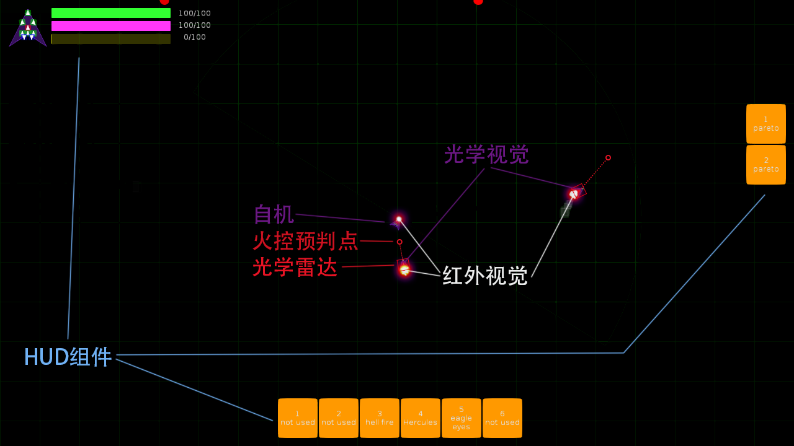

# Somalia Space Program

# 目录

[TOC]

# 背景

游戏背景设定为个人太空航行正在变得相当普遍的时代。个人已经可以拥有具有星系内跃迁能力的飞船。星系间的个人交通通过星门来实现。

太空背景的大航海时代已经到来。

由于各种各样的因素，个人飞船一般都在各个星系分布各处的小行星带内活动。而各星系的星门也修建在这些地方。

各地的星门一般由大型组织兴建与维护。此类组织一般具有雄厚的经济与技术实力，所以显然也具有与之匹配的武力。

每次使用星门需要向星门的所有者支付一定的代价。不是货币，这个时代已经没有货币这种一般等价物了。交易，通常使用资源来完成。

资源，是可以从小行星带内的小行星上采集得到的。不同的小行星带拥有不同种类和数量的资源。同样的资源在不同的小行星带内，价值也不同。比如资源A在小行星带A内普遍存在，如果在小行星带A内使用星门需要支付1000单位的资源A，那么可能在资源A非常稀少的小行星带B内，使用星门就只需要支付100单位的资源A。

在某些小行星带内，还有一些特殊种类的交易者，可以使用资源换取武器和其他装备。

星门的所有者会维持星门附近空间的秩序，会攻击并摧毁在星门附近使用武器的任何单位。
其他的个人飞船大部分为中立，主要行为是在小行星带内探索和采集资源。受到攻击会逃脱或者反击。
在小行星带内，还存在着很多海盗性质的组织，这类组织不采集资源，专门伏击路过的个人飞船，击毁或者俘获他们来掠夺资源和装备。传说还存在着武力水平能跟星门所有者抗衡的海盗团体存在，甚至有传说他们还长期占据了某个星门。

肃清海盗，维护秩序。还是利益至上，成为新的海盗之王。一切都在于你的选择。

# 界面

## 巡航&战斗

上图为一个典型的包含HUD的界面示意图。

其中，所有视觉元素均由MOD提供。无MOD的视觉效果如下图。

自机属于默认可见元素。

下图为仅安装光学视觉MOD的效果图。

下图为仅安装光学雷达的效果图。

下图为仅安装红外视觉MOD的效果图。

下图为安装了光学雷达与火控雷达的效果图。

## 交易

## 工坊

####  

# 设定(detail)

## 实体

### 类型

- 飞船
  - 自机
  - 敌机
  - NPC
  - 其他
- 环境
  - 小行星
  - 残骸
- 建筑
  - 星门
  - 太空站
- 武器
  - 惯性动能弹
  - 惯性高爆弹
  - 巡航高爆弹
  - 脉冲能束
  - 连续能束

### 属性

- 基础属性
  - UUID
  - 质量
  - 轮廓
  - 位置
  - 朝向
  - 线速度
  - 角速度
- 高级属性
  - 类型
  - ...(类型相关属性)

## MODULE

### 类型

- 能源
  - 核心
  - 外挂容器
  - 充能器
- 运动
  - 推进（提供线动量）
  - 机动（提供角动量）
- 武器
  - 发射塔（可旋转）
  - 发射架（固定）
- 功能
  - 视觉
  - 护盾
  - 跃迁
  - 散热
  - EMP
  - ...

### 属性

- 基础属性
  - UUID
  - 质量
  - 体积
  - 是否需要指定位置
  - 位置
  - 朝向
  - 功能实现方法（func）
  - 能耗（dt相关或单次能耗）
  - 冷却时间
  - 热量（dt相关或单次热量）
  - 散热速度
- 高级属性
  - 类型
  - ...(类型相关属性)

## 动作

### 推进

推进器加速时消耗能量。一般，推进器能耗大于核心产能速度。控制为增量式，松手做惯性运动。

在不大于`巡航速度`下移动时，不受阻力。

在大于`巡航速度`下移动时，受到恒定阻力。

在大于`巡航速度`继续加速，可达到`极限速度`。在`极限速度`时，阻力与推力强制相等。

> tip: 在大于`巡航速度`下加速时，推进器进入加力状态，能耗升高，推力增加，增加的推力与阻力一样，使得加速度不变。

> tip2: 提供刹车功能，按键产生人工阻力，便于达到静止状态。在某些特定区域(如NPC交互区附近)可提供自动刹车。

> tip3: 被击毁的残骸自动开启刹车。

### 转向

动量轮可提供角动量，提供一定的角加速度，有最大的角速度限制。控制为自动稳定，即松手自动反向加速至静止。

不产生能耗。

在某些不能使用能量的情况下失效。

# 实体

## 飞船

Mark III T3P1E5

### 型号
飞船型号由飞船的能量核心等级和配置组成。
使用扫描仪可通过分析其他飞船的能量流动情况得到他们的型号。

### 能量核心
能量核心等级决定了飞船总共在动力和武器系统上所能够使用的总能量。
等级由Mark I至Mark V，传说有飞船曾经扫描到过等级为Mark VI的信号源。

能量核心内部分为生成器与容器。生成器以一定速率产生能量，并储存至容器。所有船只使用的能量均从容器供应。

当容器空时，能量核心进入过载状态，产能速度增加，直到容器能量值达到安全阈值为止。

当能量核心过载，容器能量值未达到安全阈值时，除常规推进系统外，包括武器系统在内的大部分系统均处于不可用状态。

### 配置
- 推进系数：根据船体所能达到的最大速度分级，1-10，在型号中标识为T
- 结构抗性：决定船体抵御实弹攻击的能力，影响船体重量，从而影响加速度，在型号中标识为P
- 防御力场：可通过安装能量力场生成器产生，生成的力场可以在一定程度上抵御实弹和能量攻击，其在型号中的标识为E
  + 按生成器的种类可生成覆盖角度最大至360度的力场，角度越大，耗能越高。
  + 有正向，侧翼，和尾部三种方向的生成器

### 供能&散热
所有由能量核心供能的装置在工作时均会产生热量。
每个产生热量的装置均有自身恒定的散热速率。加装散热器可改变这个速率。

任意装置过热后，该装置将需等待散热至安全值才能继续操作。

武器系统在接近过热时，拥有自动抑制输出速率，从而防止过热的功能。

可通过安装主动紧急散热系统进行主动散热。主动散热时，整船向外喷射散热介质，根据散热系统的类型，可固定为每个设备排放一定的热量。在散热时，全船所有装置不可操作，船只只进行惯性移动。

### MOD
每种船体有不同数量的MOD槽位，可以安装带有特殊功能的MOD。不同的MOD有不同的能量消耗。

- 显示系统
  - 视觉显示
  - HUD

- EMP（打断跃迁，令跟踪导弹，或其他依赖电子设备的设备短时失效，使用后，本机所有电子设备需在一定时间内恢复）
- 快速跃迁发生器（不需准备的进行短距离的跃迁）
- 反跃迁场发生器（干扰一定范围内即将发生的跃迁，用于阻止敌方的支援跃迁进入战场）
- 护盾
- 主动散热器（开启时消耗能量增加散热速度）
- 引擎过载保护器（可在短时间内使引擎过载，提供额外的加速度）
- 等等

### 武器&防护
不同船体拥有不同位置不同数量的武器安装底座，可以安装各种武器。
武器分为能量武器和实弹武器。能量武器弹道快，射程远，但对能量护盾造成的压力较小。
实弹武器弹道速度，射程，和伤害根据武器类型有较大差异。爆破类的实弹武器能对能量护盾造成较大压力。

船体的防护系统包括自身的结构抗性和主动开启的能量护盾。护盾也是作为MOD的一种安装在船上。

## 核心玩法

### 战斗
#### intro
轻型船只的战斗模式类似于空战狗斗，凭借操作与机动性进行hit&run的战斗。或者安装牵制&干扰类型的MOD辅助旗舰输出。

能量系统与护盾系统，决定了一艘船在不受到结构损伤的情况下，单次所能受到的最大的伤害量。

武器、使用MOD与机动均会消耗能量核心容器内的能量。在火力全开的情况下，能量核心的产能速度一般是无法满足输出需求的。这样就需要进行有节奏的、高效率的输出。而安装护盾的船只，如果同时安装了高能耗的火力，那么势必护盾所能吸收的伤害量将会大打折扣。这样就决定了拥有厚实护盾的船只，无法同时驱动密集的火力输出，达到一种平衡。

#### 封闭空间
若需要产生封闭的战斗环境，如boss战，或者任务战斗之类，可做如下设定：在玩家进入一定范围后，敌人会部署一个空间翘曲发生器，位置固定，具有较高的护盾。在其存在时，一定范围内的空间自成封闭，即从左端出去会从右端进来。

在设定玩家能逃离的情况下，玩家击毁空间翘曲发生器后，敌方会由于担心支援的到来而直接跃迁逃离战场。则战斗结束。或者玩家成功跃迁也可结束战斗。

在设定玩家无法逃离的情况下，空间翘曲发生器将拥有很高的护盾值，并且安装了可以覆盖整个翘曲空间的EMP，当玩家尝试跃迁时，均会被其打断。

#### 视觉系统

视觉系统可获取物理世界的信息，并转换为图像的形式展现给玩家。视觉系统获取的信息只能被玩家用肉眼解读，其他系统无法利用。

目前已设计的视觉系统有可见光视觉系统和红外视觉系统。

红外视觉系统可设计为中等能耗MOD，使其在低级船中只能短时间开启。

#### 雷达系统

雷达系统可以获得物理世界的对象的数据信息，包括位置、速度、外廓、质量等。这些数据可以与其他系统共享。

#### 子弹&火炮

近程&中程动能武器。子弹主要用于拦截接近的导弹、鱼雷等爆破武器。

火炮一般用于中等距离的火力输出。一般射程、攻击力与装填速度相关。超大型火炮也能攻击到很远距离的目标。

此类武器在发射后只进行惯性运动，与物体碰撞后造成伤害。

不可被摧毁。

#### 鱼雷

攻击距离最远。伤害范围最大。需在发射前指定坐标。

发射后自行机动转向对准坐标，然后向目标方向缓慢加速至极速。

引爆方式为定时引爆。在发射时，武器系统为其计算引爆时间，发射后即开始倒计时。不需雷达系统参与。

出于安全设定，有最小引信时间限制。

由于机动转向对准目标所需时间的偏差，引爆时间存在一定的误差。

在转向完成前被干扰，会认为已经对准坐标，直接进入加速。

可被摧毁。被摧毁时不引爆。

#### 导弹

近中程制导武器。也有超重型的版本能够攻击到很远距离的目标。

自身无制导能力，通过武器-雷达系统实现制导。

自身被干扰时，会自毁。

依赖的武器-雷达系统被干扰时，会以最后一帧坐标为目标制导。

与物体碰撞后造成伤害。

可被摧毁。被摧毁时引爆。

#### 能量武器

##### 能束

中程能量武器。

发射前需经过短暂的充能，发射持续一定时间。造成的伤害按接触时间计算。

轻型的版本由于其速度和连续性的优势，通常用于拦截。

重型和超重型的版本通常作为主火力的一部分。

无碰撞。

##### 脉冲

特性与子弹类似。优势是比实弹系统轻，转向更快。

但能耗比子弹要高。

并且由于是能量武器，对护盾造成的伤害较小。

并且能被全反射MOD所反射。

无碰撞。

#### HACK系统

在近距离上，HACK对方MOD后，可以取得被HACK部分完全的控制权。

比如HACK到火控雷达后，可把目标坐标修改为对方自身坐标。

HACK到武器系统后，可直接关闭武器系统。

在自由战斗中，可以给予受限的指定功能。

如在自由战斗中，设定武器系统、推进系统被hack的效果就是关闭。火控雷达被hack的效果就是制导武器锁定自身。

在剧情中，在受限的场景下，会有很高可玩性和趣味性。

#### 隐身

隐身MOD，开启后无法被雷达侦测到，无法被可见光视觉系统捕获到。但不影响红外视觉系统的捕获。

同护盾使用能量的机制，开启后，直接占用一定能量容积作为缓冲区。

隐身MOD本身不产生热量。

包括推进系统在内，产生热量的MOD，均可被红外视觉系统捕获。

全静默状态下，无法被任何探测系统捕获。

受到攻击则自动退出隐身状态。

主要装备于鱼雷轰炸机，EMP攻击机和间谍机(hacker)上。

隐身接近的方式为，远距加速，开启隐身，惯性滑行至目标附近，然后展开攻击，最后脱离。

敌人反隐身方式主要为弹幕覆盖。

### 交易

#### 资源

可以设定复数种资源类型，建议不少于5种。

每种资源的价值由当地含量决定。

没有货币。所有交易均分别显示置换物品所需的各种资源的数量。玩家可选择用某种资源去置换。

## 关卡（默认）

此节仅描述设计用于游戏教学和展示游戏特性的默认关卡。

### 第一章 - 母星毁灭

#### 0.登船

包含操作：

- 基本移动
- UI介绍

#### 1.恒星系内导航

简单来说就是从A点前往B点的操作。

包含操作：

- 与NPC交互
- 货舱界面操作
- 识别小地图
- 移动

从NPC A手中接过货物，送往NPC B手中。在途中遭遇海盗。

#### 2.遇敌

基本的战斗操作。

包含操作：

- 鼠标瞄准
- 开火
- 拾取物品

使用船上的机炮击毁海盗后，拾取到数种资源和一个MOD。

#### 3.交易&安装MOD

使用资源置换采矿MOD，并与上一节拾取的MOD一同安装到船上。

包含操作：

- 交易界面操作
- 飞船配置界面操作

